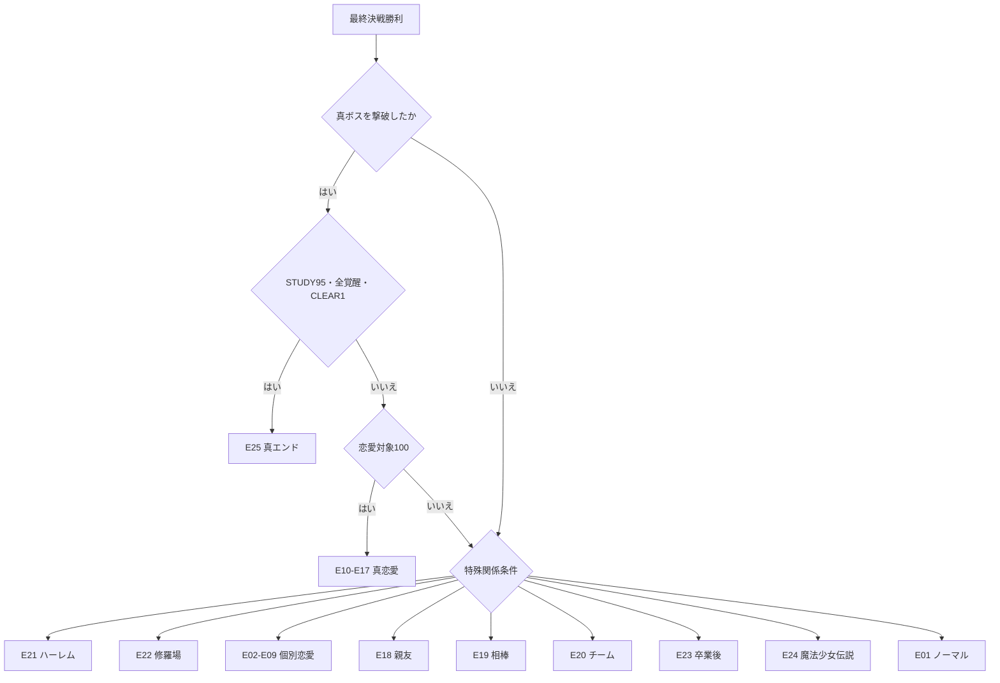

# マジック編 エンディングフロー

## 1. 判定タイミング

マジック編は本編の章構成を維持し、3章を通常進行、4章をボス戦として扱う。
エンディング判定は4章ボス戦または真ボス戦の勝利後に行う。

## 2. 判定順

1. 真エンド条件
2. 真恋愛エンド
3. ハーレム、修羅場
4. 個別恋愛エンド
5. 親友、相棒、チーム
6. 卒業後、魔法少女伝説
7. ノーマルエンド

上位条件を満たした場合でも、最終選択で下位エンドを選べる。

## 3. エンディング一覧

| ID | 名称 | 解放条件 | 登場人物 | イベント概要 |
| --- | --- | --- | --- | --- |
| E01 | 普通の卒業式 | 最終戦勝利 | 主人公、全員 | 学園生活を終え、それぞれの道へ |
| E02-E09 | 個別恋愛エンド | 対象好感度95 | 主人公、恋愛対象8人 | 二人で卒業後の未来を選ぶ |
| E10-E17 | 真恋愛エンド | `STUDY95`、対象100、真ボス撃破 | 主人公、恋愛対象8人 | 恋と使命を両立した特別未来 |
| E18 | 親友エンド | `FRIEND80`、恋人成立なし | 主人公、親友 | 離れても続く親友関係 |
| E19 | 相棒エンド | 相棒値90、共闘選択 | 主人公、相棒 | 魔法少女コンビとして活動 |
| E20 | チームエンド | `TEAM70`、全員生存 | 主人公9人 | 九人で学園の守護者になる |
| E21 | ハーレムエンド | 全対象80以上、合意イベント、修羅場解決 | 主人公、対象8人 | 全員が納得した特殊共同未来 |
| E22 | 修羅場エンド | 修羅場未解決 | 主人公、複数対象 | 信頼を失い一人で卒業 |
| E23 | 卒業後エンド | 進路値最大 | 主人公、進路関係者 | 魔法以外の夢も選び取る |
| E24 | 魔法少女伝説 | 全ダンジョン完全攻略 | 主人公9人 | 後世に語られる守護者となる |
| E25 | 星界の扉・真エンド | `CLEAR1`、`STUDY95`、全主人公覚醒、真ボス撃破 | 主人公9人、セラ | 異世界と現実を救い共存を選ぶ |

## 4. フロー



## 5. エンディング用必要素材

- エンディングCG: 恋愛個別8、真恋愛8、主人公別卒業後9
- 共通卒業式CG
- 親友エンドCG9
- チーム、修羅場、ハーレム用CG
- エンドカード、タイトル帰還演出、周回引継ぎ画面

## 6. AI画像生成プロンプト

```text
Final ending CG for a Japanese anime magical academy visual novel.
Use the exact established heroine and route character designs.
Show a decisive future-facing moment after graduation, with clear emotional closure,
visual symbolism from the route attribute, and a readable 16:9 composition.
Age-appropriate, non-sexualized, no text, no logo, no watermark, no UI.
1920x1080 master, final delivery as WebP.
```

## 7. 実装時データ

実装工程では `endings.ts` にID、優先順位、条件、CG ID、引継ぎ報酬を定義する。
判定は独立モードではなく、既存本編の4章ボス戦後の結果処理に接続する。
