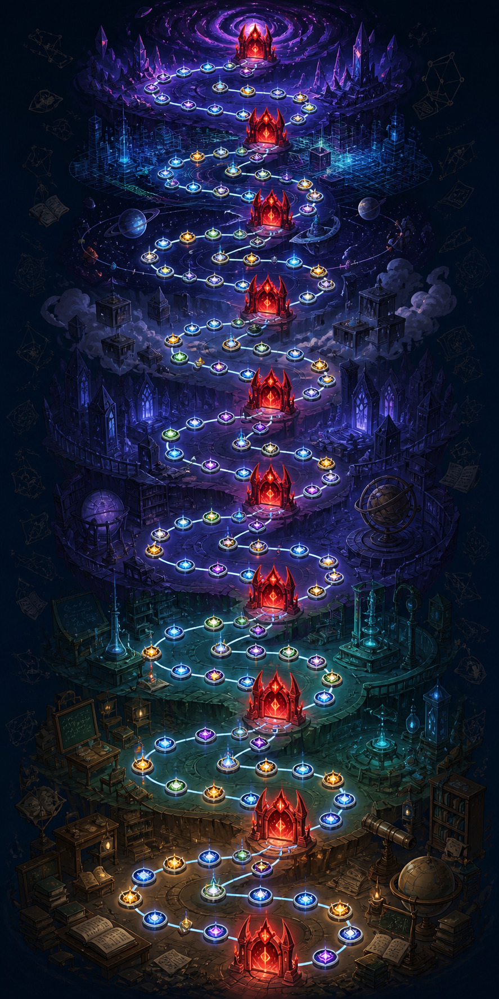

# エンドレスモード 50章制・5章ごとボス ギミック改訂案（旧案）

> この資料は「50F＝50章、1章＝1F」として作成した旧案です。1章を通常Act1と同じ15Fにする現行案は、[endless-mode-50chapter-15f-map-revision.md](endless-mode-50chapter-15f-map-revision.md) を参照してください。

## 1. 目的

エンドレスモードを「50F」だけでなく、プレイヤーが進行を把握しやすい「50章」として扱う。ボスは5章ごとに配置し、ボス到達までの5章区間を使ってギミックの準備・達成を行う。

本書は、既存の [50Fボス編成・イラスト整合性資料](endless-mode-boss-lineup-50f.md) を、50章表記と5章区間単位の進行へ置き換えるための設計資料である。

## 2. 前提の修正

| 項目 | 新仕様 |
|---|---|
| 全体 | 50F ＝ 50章（C01〜C50） |
| ボス章 | C05、C10、C15、C20、C25、C30、C35、C40、C45、C50 |
| ボス数 | 1編につき10体。小学生編・高校編・マジック編を別編として合計30体 |
| 区間 | 5章を1区間として、S01〜S10に分ける |
| 最終章 | C50。各編の最終ボスを配置する |

### 重要な解釈

「50F＝50章」かつ「5章ごとにボス」の場合、ボスの数値上の間隔は現行の「5Fごと」と同じである。したがって今回の変更は、ボスの出現頻度を10体から減らす変更ではなく、次の2点を変更するものとして扱う。

1. 進行表示をF単位から章単位へ統一する。
2. ギミックの達成機会を、ボス戦だけでなく「直前4章＋ボス章」の5章区間へ広げる。

本当にボス間隔を長くする場合は、「1章＝何Fか」を別途定義する必要がある。本案では、ユーザー指定どおり1F＝1章を採用する。

## 3. 50章マップのイメージ



> 画像は仕様検討用のコンセプトイメージ。C01を下、C50を上に置く縦長マップ、5章ごとのボスゲート10個、各区間内の分岐ノードを表現している。最終UIでは、既存のマップノード・背景・アイコンシステムへ置き換える。

### 3.1 区間の構造

各区間は、原則として「準備4章＋ボス1章」で構成する。

| 区間 | 章 | 役割 |
|---:|---|---|
| S01 | C01〜C05 | 序盤の準備、C05ボス |
| S02 | C06〜C10 | 学習・カード条件の蓄積、C10大ボス |
| S03 | C11〜C15 | 分岐と対策、C15ボス |
| S04 | C16〜C20 | 複数条件の達成、C20大ボス |
| S05 | C21〜C25 | ギミックの応用、C25ボス |
| S06 | C26〜C30 | カード／学習条件の混成、C30大ボス |
| S07 | C31〜C35 | 高難度条件の準備、C35ボス |
| S08 | C36〜C40 | 連続条件の達成、C40大ボス |
| S09 | C41〜C45 | 終盤ギミックの確認、C45ボス |
| S10 | C46〜C50 | 最終準備、C50最終ボス |

### 3.2 マップノードの配置ルール

- 各章に少なくとも1つの進行可能ノードを置く。
- C01、C06、C11など区間開始章は通常戦闘または学習ノードを中心にする。
- C02〜C04、C07〜C09などは、通常戦闘・エリート・イベント・休憩・学習ノードを分岐させる。
- ボス章の直前には、休憩または学習ノードへ到達できるルートを最低1本確保する。
- ギミックが学習成功を要求する区間では、区間内に最低2回の学習機会を保証する。足りない場合はボス戦中に学習判定を追加する。
- C50は通常のボスゲートではなく、最終ボスゲートとして表示する。

## 4. ギミック共通仕様

### 4.1 進捗の有効期間

- ギミック進捗は区間開始章からボス撃破・報酬確定まで保持する。
- ボス撃破後、次の区間へ進むと現在の区間ギミックをリセットする。
- クリア済みボスの達成記録は周回中保持し、マップへ戻ったときに表示する。
- セーブ・協力プレイ同期の対象にする。

### 4.2 学習判定

- 正解した通常の学習判定のみをカウントする。
- 再提出・リトライによる正解は、再提出専用ギミック以外では新しい成功として重複カウントしない。
- 不正解は、単純な成功回数を減らさない。ただし「連続成功」条件の連続数は0へ戻す。
- `subjectId` が同じでも達成可能とする。異なる分野・異なる科目を必須にしない。
- `subjectId` がない場合も、単純な学習成功回数のギミックはカウントする。分野そのものを参照する報酬だけ、従来どおり対象外とする。

### 4.3 カード判定

魔法編を含む全編で、カード種類は次の3分類だけを使用する。

- `ATTACK`
- `SKILL`
- `POWER`

旧仕様の `attributeId` や、問題側に存在しない属性IDはギミック達成条件に使わない。

### 4.4 難易度の上限

| ボス種別 | 目安 | 達成条件の上限 |
|---|---|---|
| 通常ボス | 5章区間内で1〜2回の行動 | 1条件、または2連続／2種類 |
| 大ボス | 5章区間全体を使う | 3回、3種類、または均衡条件 |
| 最終大ボス | S10全体を使う | 4つの記録。異なる分野・属性は要求しない |

「区間内に必要な学習機会がない」「同じ単元しか出ないと達成不能になる」といった状態を作らない。特に3回条件は、同じ `subjectId` の3回成功で必ず達成可能にする。

## 5. マップ表示と達成記録

### 5.1 次のボス表示

マップ上部の次の節目表示を、次の形式へ統一する。

```text
次の節目：C10 三相試験体トライクス
弱点：S02内で学習判定に3回成功
ギミック：S02の5章区間で学習判定に3回成功。同じ単元でもよい。
備え：学習機会と防御カードを確保
```

### 5.2 達成済み表示

ギミック達成後、マップ画面のギミック表示文に必ず達成状態を追記する。

```text
ギミック：S02の5章区間で学習判定に3回成功。同じ単元でもよい。（達成済み）
```

ボス撃破後も確認できるよう、次のボス表示の下に直近の達成記録を表示する。

```text
ギミック達成記録：C10 三相試験体トライクス — 学習判定に3回成功（達成済み）
```

## 6. 小学生編：C05〜C50

| 章 | ボス | 改訂ギミック |
|---:|---|---|
| C05 | 墨核端末ピポ | S01内で学習判定に1回成功。最初の弱体を無効化した場合も達成扱いにする。 |
| C10 | 採点殻ヴァルナ | S02内で学習判定に3回成功。連続成功として扱うが、同じ `subjectId` でよい。 |
| C15 | 門式端末オクト | S03内で学習判定に2回連続成功。失敗時のみ連続数をリセットする。 |
| C20 | 三相演算体オルビス | S04内で学習判定に3回成功。異なる分野は要求しない。 |
| C25 | 頁喰いミラ | S05内でページ封印が発生した後、学習判定に1回成功。 |
| C30 | 三監プロトコル・ノア | S06内で `ATTACK`・`SKILL`・`POWER` の3種類を1回ずつ解決。順番は自由。 |
| C35 | 刻喰いクロノル | C35ボス戦の3ターン以内に `ATTACK` を1枚解決。 |
| C40 | 反復機リピタ | S08内で同じ `subjectId` の学習判定に3回連続成功。 |
| C45 | 空白面ブランクス | S09内でカードが未定義化された後、学習判定に1回成功。 |
| C50 | 零号記録者ノクス・ルート | S10内で学習判定に4回成功し、4つの記録を解除。異なる分野は要求しない。 |

## 7. 高校編：C05〜C50

| 章 | ボス | 改訂ギミック |
|---:|---|---|
| C05 | 再提出官レドゥン | S01内で失敗した学習判定を1回再提出し、成功する。再提出機会を最低1回保証する。 |
| C10 | 三相試験体トライクス | S02内で学習判定に3回成功。異なる分野は要求しない。 |
| C15 | 通知残響ネイヴ | S03内で学習判定に1回成功し、通知／ノイズを解除する。 |
| C20 | 規約執行体ヴェルデック | S04内で学習判定に3回成功し、規約リングを3枚解除する。 |
| C25 | 化成炉主任カルブリス | S05内で `ATTACK` を2枚連続で解決。途中で別カードを解決した場合は連続数をリセットする。 |
| C30 | 屋上演算体バルグリフ | S06内で異なるカード種類を3種類解決。順番は自由。 |
| C35 | 評定演算体モノメル | S07全体の攻撃・ブロック・学習成功を各最大3件で集計し、最大値と最小値の差を1以内にする。 |
| C40 | 白紙皇后アウレリア | S08内で学習判定に1回成功し、白紙ルールを解除する。 |
| C45 | 周波監査体オルト | S09内で学習判定に2回連続成功し、遮断波形を止める。 |
| C50 | 零号判定者ノクス・プライム | S10内で学習判定に4回成功し、4つの判定記録を解除。カード種類・別分野は要求しない。 |

## 8. マジック編：C05〜C50

| 章 | ボス | 改訂ギミック |
|---:|---|---|
| C05 | 時相端末テンポラ | C05ボス戦の3ターン以内に `ATTACK` を1枚解決。 |
| C10 | 封印監理体カテドラ | S02内で異なるカード種類を2種類連続で解決。属性IDは使用しない。 |
| C15 | 反照体ヴェイル | S03内またはC15ボス戦で `SKILL` を1枚解決。 |
| C20 | 三属性監督体プリズマ | S04内で異なるカード種類を3種類解決。変身状態に関係なくカード種類で判定する。 |
| C25 | 星鍵収束体キーファ | S05内で学習判定に2回連続成功。異なる分野は要求しない。 |
| C30 | 欠月炉エクリプサ | S06内で異なるカード種類を2種類解決し、月相を切り替える。 |
| C35 | 深層頁獣アビスラ | S07内でカード封印後に学習判定へ1回成功し、封印ページを回収する。 |
| C40 | 軌道観測体オルビタ | S08内で学習判定に2回連続成功し、観測防壁を解除する。 |
| C45 | 変身残像体モルファ | S09内で異なるカード種類を2種類解決。主人公の属性や変身形態は条件にしない。 |
| C50 | 零号星核ノクス・オリジン | S10内で学習判定に4回成功し、時間・封印・反照・軌道の4記録を解除。カード種類・別分野は要求しない。 |

## 9. 実装時のデータ設計

### 9.1 章と区間

- `floor` は互換性のため残し、表示上は `C01`〜`C50` の章番号として扱う。
- `chapter = floor` とする。
- `segment = Math.ceil(chapter / 5)` とする。
- ボス定義には `chapter` または既存の `floor` と、`segment` を持たせる。
- ボスIDは既存セーブとの対応を壊さないため、当面は既存IDを維持する。

### 9.2 ギミック進捗

```ts
type EndlessChapterGimmickProgress = {
  segment: number;
  progress: number;
  target: number;
  achieved: boolean;
  streak?: number;
  learningCount?: number;
  cardTypes?: string[];
  phases?: number[];
};
```

学習判定・カード解決のイベントを区間進捗へ渡し、次のボスへ切り替わった時点で新しい進捗レコードを作る。ボス章だけでなく、C01〜C04などの準備章のイベントも現在区間へ記録する。

### 9.3 既存セーブとの移行

- 既存の50Fセーブは、`floor` とボスIDが同一のため章番号へそのまま読み替えられる。
- ボス未撃破中のギミック進捗は、新しい区間スコープと条件が異なるため、読み込み時に0へ戻してよい。
- クリア済みボスの達成記録は、旧セーブに存在しないため未達成として扱う。
- 仕様変更後の最初のエンドレス開始時に、ギミック進捗の新形式を初期化する。

## 10. 受け入れ確認項目

- [ ] 50FがC01〜C50として表示される。
- [ ] C05、C10、C15、C20、C25、C30、C35、C40、C45、C50だけがボス章になる。
- [ ] ボスまでの5章区間でギミック進捗が保持される。
- [ ] 同じ `subjectId` の学習成功だけでも、3回条件を達成できる。
- [ ] 異なる分野・異なる科目・`attributeId` が必須条件に残っていない。
- [ ] 学習機会のない区間が生成されない。
- [ ] ギミック達成後、マップのギミック表示文に「（達成済み）」が付く。
- [ ] ボス撃破後、マップに直近の「ギミック達成記録」が表示される。
- [ ] セーブ・ロード・協力プレイ同期で進捗が失われない。
- [ ] C50の最終ボスだけは、4記録を達成する終盤向けギミックとして表示される。

## 11. 未決定事項

1. 「5章ごと」を、今回のようにC05・C10…へ置く意味で使うか、ボス間隔そのものを現在より長くするか。
2. 章タイトルを「C01 学習開始」のように表示するか、数字だけを表示するか。
3. 5章区間をマップ背景の色・地形・BGM切り替えにも反映するか。
4. ギミック達成時に、マップ表示だけでなくボス戦中の演出・報酬倍率も連動させるか。
